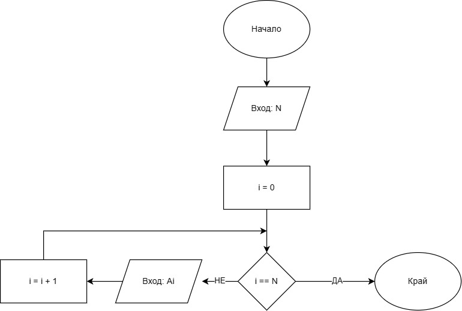
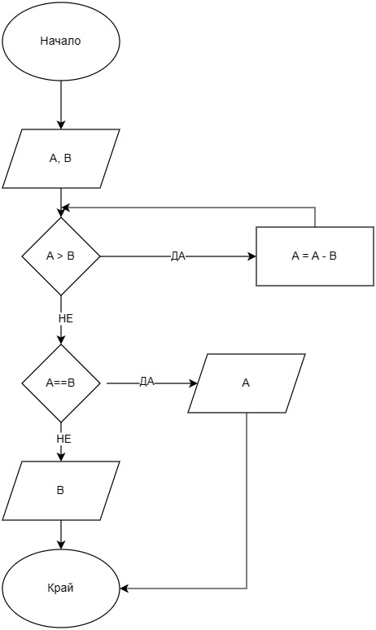

# Задача 5 

Съставете блок-схема на алгоритъм, който въвежда цяло число в променливата N и след това N цели числа в променливите А 1, А2, ••• , AN.

# Задача 7 

Съставете блок-схема на Алгоритъма на Евклид за намиране на най-голям общ делител на целите числа (НОД[А, В]).
Упътване: Използвайте твърдението, че ако А > В > О, тогава НОД[А,В] = НОД[А - В,В],
        

